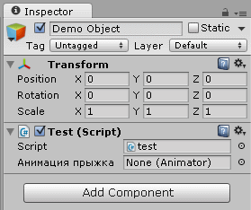
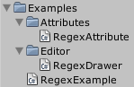
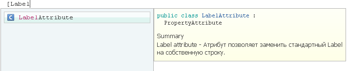

Начнем с самого простого, заменим Label у переменной на собственный, должно получиться вот так:

Для начала подготовим иерархию директорий для нашего Property Drawers. Здесь желательно соблюсти небольшое правило: Файлы Attribute в отдельную папку "Attributes", файлы Drawers в папочку "Editor". Создайте обе этих директории прежде чем приступать к реализации самих скриптов.
У вас должно получится примерно вот так:

Это не строго обязательно, но очень желательно.
Теперь приступим к созданию собственно атрибута:
Создайте файл скрипта C# в директории "Attributes".
Присвойте ему имя "LabelAttribute". Использование добавки Attribute в конце названия не обязательно, но при работе в Mono или VisualStudio довольно просто будет выбрать нужный атрибут из выпадающего списка просто введя "Attrib" например.
После создания скрипта откройте его в редакторе кода и удалите все что там есть.
Далее вводим следующее:

	/// 

	/// Label attribute - Атрибут позволяет заменить стандартный Label на собственную строку.
	/// 

	public class LabelAttribute : PropertyAttribute
	{
		public string Text;
		public LabelAttribute(string text)
		{
			this.Text = text;
		}
	}

Теперь давайте разберем что в этом маленьком скрипте и за что отвечает.
В тегах 
 необязательное описание атрибута. Хотя опять-же - очень желательное, а то можно долго не пользоваться атрибутом и просто забыть для чего он был нужен  :ymsmug:

Далее область видимости класса "public", само название класса и родитель PropertyAttribute. Именно PropertyAttribute и отвечает за возможность использования атрибутов в инспекторе объектов.
Далее объявляется публичная переменная отвечающая за пока единственный параметр нашего атрибута, ей желательно дать осмысленное название, так как в дальнейшем мы ее будем использовать.
И конечно конструктор класса, с его помощью мы и будем инициализировать наш класс. Здесь все просто: Единственный параметр конструктора принимает строковое значение и присваивает его переменной "Text".
На этом создание самого атрибута закончено. Его даже можно использовать, но пока толку от этого не будет. Нам предстоит создать еще один скрипт, который и отвечает за обработку логики замены стандартного значения Label на наше собственное значение.
И так, давайте создадим еще один скрипт. Создавать его нужно в директории "Editor".
Название присвоим в соответствии с вышеназванным атрибутом, только в конце добавим уже слово "Drawer". И у нас должен получится скрипт с именем "LabelDrawer".
Как и в при создании атрибута очищаем скрипт от всего кода и вписываем следующее:

	using UnityEngine;
	using UnityEditor;

	[CustomPropertyDrawer(typeof(LabelAttribute))]
	public class LabelDrawer : PropertyDrawer
	{
		LabelAttribute labelAttribute
		{
			get
			{
				return (LabelAttribute) attribute;
			}
		}
		public override void OnGUI(Rect position, SerializedProperty property, GUIContent label)
		{

			if (!string.IsNullOrEmpty(labelAttribute.Text))
			{
				EditorGUI.PropertyField(position, property, labelAttribute.Text);
			}
					else	EditorGUI.PropertyField(position, property, label);
		}
	}

Как вы наверное заметили у нас добавилась дополнительная директива 
	using UnityEditor; 
Она отвечает за все элементы интерфейса инспектора (и многое еще за что).
Далее перед определением класса у нас идет атрибут 
	[CustomPropertyDrawer(typeof(LabelAttribute))] 
который используется для получения типа объекта нашего атрибута и назначения его в качестве атрибута CustomPropertyDrawer уже нашему новому классу (надеюсь сформулировал правильно  :-  ну не селен я объяснять высшие материи в пару строк...).
Затем следует объявление самого класса LabelDrawer унаследованного в отличии от LabelAttribute уже от PropertyDrawer.

	LabelAttribute labelAttribute
	{
		get
		{
			return (LabelAttribute) attribute;
		}
	}
	
Данный кусок кода отвечает за получение ссылки на экземпляр атрибута LabelAttribute и присвоение этой ссылки переменной labelAttribute.
А далее метод отрисовки нового Gui взамен стандартного, где мы мошенническим образом и подменяем наш Label.
	public override void OnGUI
Создаем публичный, модифицируемый по отношению к родительскому классу метод OnGUI.
	if (!string.IsNullOrEmpty(labelAttribute.Text))
Проверяем наличие данных для замены (чтобы строка не содержала nul или Empty), если labelAttribute.Text содержит правильный текст, тогда:
	EditorGUI.PropertyField(position, property, labelAttribute.Text);
В редакторе GUI создаем поле PropertyField с параметрами полученными из параметров метода OnGUI и последним параметром отвечающим собственно за Label, который мы возьмем по ссылке из LabelAttribute.
При этом PropertyField принимает следующие параметры:
position - расположение поля относительно окна инспектора, задается в виде класса http://docs.unity3d.com/Documentation/ScriptReference/Rect.html]Rect .
property - сериализируемые параметры объекта предназначенные для редактирования в упрощенном виде.
label - Собственно наш Label который мы и меняем.

	else	EditorGUI.PropertyField(position, property, label);
Ну и как завершающий штрих - если не пройдена проверка IsNullOrEmpty и labelAttribute.Text вернул null или empty тогда берем стандартные данные, ничего не меняем, и вставляем их на место.
На этом создание Property Drawers LabelAttribute закончен. Теперь нам остается только вызвать его в любом скрипте при инициализации публичной переменной.
Вот пример:

	using UnityEngine;
	using System.Collections;

	public class test : MonoBehaviour {
		[LabelAttribute("Анимация прыжка")]
		public Animator anim;
	}